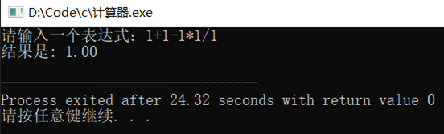
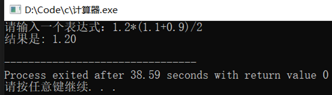
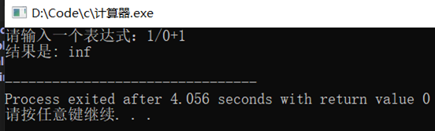

# computer-math
基于c++开发的数学计算器
## 编写程序，完成手机计算器中表达式的求解（难度分为四级）
- 基本要求：无括号、整数
- 高级要求：有括号、整数
- 超级要求：有括号、小数
- 顶级要求：有括号、复数
##  需求分析
- 输入功能: 用户可以输入一个数学表达式，表达式支持加法、减法、乘法、除法以及括号和小数。
- 输出功能: 程序能够解析用户输入的表达式，并计算出结果，结果应以小数格式显示。
- 特色功能：能够正确找到算术优先级，进行括号的区分。
## 概要设计
- 模块划分:
  - 输入模块: 负责接收用户输入的表达式并进行基本验证。
  - 解析模块: 将输入的表达式解析为数值和运算符，并处理括号和小数。
  - 计算模块: 执行解析模块传递的运算，并返回结果。
  - 输出模块: 负责将计算结果格式化并输出到用户界面。

- 数据结构:
  - 使用栈（stack）存储数值和运算符，以便正确处理运算顺序和括号。
  - 使用数组或链表存储用户输入的表达式。
- 异常处理:
  - 在解析和计算过程中，需检查用户输入的合法性，处理除以零、未配对的括号等错误情况。
  - 提供明确的错误信息，以便用户能够理解输入问题。

## 测试结果
 
 
 
 
 

